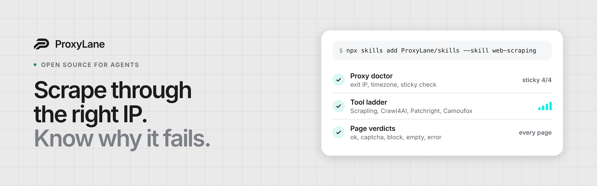
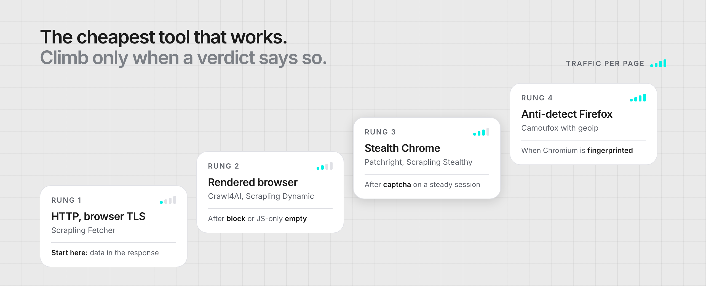

<a href="https://proxylane.dev/?utm_source=github&utm_medium=org_profile&utm_campaign=github_org&utm_content=banner">
  
</a>

<p>
  <a href="https://proxylane.dev/?utm_source=github&utm_medium=org_profile&utm_campaign=github_org&utm_content=badge"></a>
  <a href="https://docs.proxylane.dev/?utm_source=github&utm_medium=org_profile&utm_campaign=github_org&utm_content=badge"></a>
  <a href="https://proxylane.dev/mcp-access?utm_source=github&utm_medium=org_profile&utm_campaign=github_org&utm_content=badge"></a>
  <a href="https://skills.sh/ProxyLane/skills"></a>
</p>

**Residential proxies for browser workflows, and the open tools we use to make scraping and automation work.** Everything here runs with any proxy provider.

## Start in one line

**Give your agent a scraping playbook** (Claude Code, Codex, Cursor and other agents):

```bash
npx skills add ProxyLane/skills --skill web-scraping
```

**Let your agent manage proxies** over OAuth, no API key:

```bash
claude mcp add --transport http proxylane https://proxylane.dev/mcp
```

**Run tested examples** in Python, curl and Playwright:

```bash
git clone https://github.com/ProxyLane/proxy-examples
```

## Open source

| Repository | What it is |
| --- | --- |
| [**skills / web-scraping**](https://github.com/ProxyLane/skills/tree/main/skills/web-scraping) | Agent skill: a five-rung tool ladder (Scrapling, Crawl4AI, Patchright, Camoufox, HeadlessX), a proxy doctor and a page-verdict classifier. Code verified against current releases |
| [**skills / proxy-setup**](https://github.com/ProxyLane/skills/tree/main/skills/proxy-setup) | Agent skill: configure an HTTP or SOCKS5 proxy, verify the exit IP, diagnose 407s, timeouts and TLS errors without leaking credentials |
| [**proxy-examples**](https://github.com/ProxyLane/proxy-examples) | Python, curl and Playwright examples that turn proxied requests into validated records, plus a provider migration worksheet |
| [**MCP server**](https://proxylane.dev/mcp-access?utm_source=github&utm_medium=org_profile&utm_campaign=github_org&utm_content=table) | Hosted Streamable HTTP server with OAuth 2.1: create sticky connections, check IP reputation, export to Dolphin, AdsPower and Octo |

## What the web-scraping skill does



```text
1. proxy_doctor.py    checks the exit before anything depends on it
                      US, New York, AS701 Verizon, sticky 4/4 probes on one IP
2. tool ladder        HTTP with browser TLS first, a real browser only when a verdict asks for it
3. verdict.py         ok | captcha | block | empty | error for every page, never "no results"
4. one change         per verdict, judged on 10+ attempts in the same hour
```

The ladder exists because a browser costs more traffic than a request, and residential traffic is billed per GB. The verdicts exist because a challenge page saved as data looks like success until someone reads it.

<sub>Doctor output from a live run on 2026-10-07 through a ProxyLane US sticky session.</sub>

## How we build

- **Cheapest tool first.** Escalate on a classified failure, not on a hunch.
- **Name every failure.** A CAPTCHA, a block and an empty page need different fixes.
- **One identity, one sticky exit.** A browser profile never rides a rotating gateway, and its timezone comes from its own exit.
- **Credentials stay in the environment.** No example prints, logs or commits them.
- **Numbers carry denominators and dates.** `41/50 ok` on a date, not "high success rate".

Issues and pull requests are welcome in every public repository. A failing case with the tool version, the verdict and the steps to reproduce helps most.

<p>
  <a href="https://proxylane.dev/?utm_source=github&utm_medium=org_profile&utm_campaign=github_org&utm_content=footer">Website</a> &nbsp;/&nbsp;
  <a href="https://docs.proxylane.dev/?utm_source=github&utm_medium=org_profile&utm_campaign=github_org&utm_content=footer">Documentation</a> &nbsp;/&nbsp;
  <a href="https://proxylane.dev/pricing?utm_source=github&utm_medium=org_profile&utm_campaign=github_org&utm_content=footer">Pricing</a> &nbsp;/&nbsp;
  <a href="https://proxylane.dev/mcp-access?utm_source=github&utm_medium=org_profile&utm_campaign=github_org&utm_content=footer">MCP</a>
</p>
